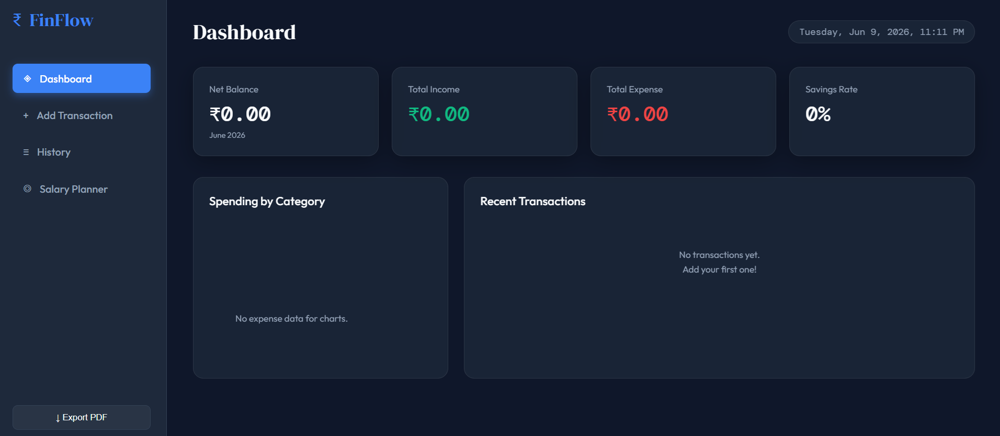

# FinFlow — Personal Finance Manager

A responsive personal budget tracking web app built with vanilla HTML, CSS, and JavaScript.

## Features

- **Dashboard** — Live net balance, total income, total expense, and savings rate
- **Category Breakdown** — Animated bar chart showing spending by category
- **Add Transactions** — Add income or expense with category, date, and notes
- **Transaction History** — Search, filter by category and type, edit or delete entries
- **Salary Planner** — Calculate monthly in-hand salary from CTC with PF and tax regime (New/Old)
- **PDF Export** — Download full transaction history as a formatted PDF
- **Persistent Storage** — All data saved in localStorage, survives page refresh

## Tech Stack

- HTML5
- CSS3 (Glassmorphism UI, CSS Variables, Animations)
- JavaScript (ES6+ Classes, OOP Architecture)
- jsPDF + AutoTable (PDF generation)
- Google Fonts (DM Serif Display, DM Mono, Outfit)

## Project Structure
 financetracker/
├── index.html
├── css/
│   └── style.css
├── js/
│   └── app.js
└── README.md

## Screenshots

## Author

YASHIKA ARORA  
B.E. Computer Science, Siddaganga Institute of Technology, Tumkur  
[LinkedIn](https://www.linkedin.com/in/yashika-arora-1b2a27319?utm_source=share_via&utm_content=profile&utm_medium=member_ios) | [LeetCode](https://leetcode.com/u/arorayashika22/)